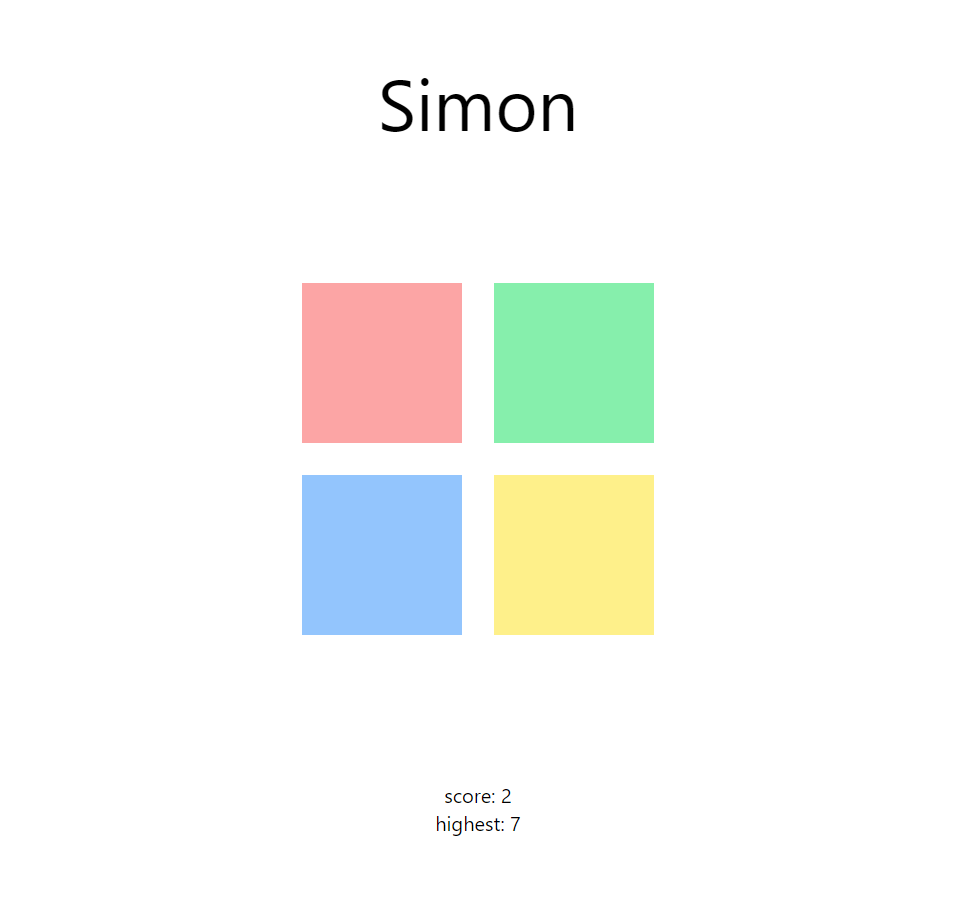

# Simon Game

<p align="center">
    
</p>

## Description

A replica of the simon game [https://freesimon.org/](https://freesimon.org/)

## Getting Started

Clone: `git clone git@github.com:Refaelbenzvi24/simon-game.git`

> NOTE: if you are using pnpm you can install all the dependencies from the root folder otherwise just go to each
> folder(client & server) and install independently.

> NOTE: other than the above comment everything being done with pnpm here can be accomplished with npm/yarn/etc...

### With pnpm

```bash
pnpm i
```

### With npm

```bash
cd server
npm i
cd ../client
npm i
```

then:

install postgres and pgadmin using docker(from root folder):

```bash
docker compose up # from root folder
```

Migrating dev server:

```bash
cd server
pnpx prisma migrate dev
```

now you'll need 2 terminals, one for each service(server, client)

start server dev server(terminal 1):

```bash
cd server
pnpm run dev
```

start client dev server(terminal 1):

```bash
cd server
pnpm run dev
```

## What I've used

### Server

- TypeScript
- Express
- Prisma - ORM
- Postgres - DB
- Zod - Validations

### Client

- TypeScript
- Vite - Bundler
- React
- TailwindCss
- Axios
